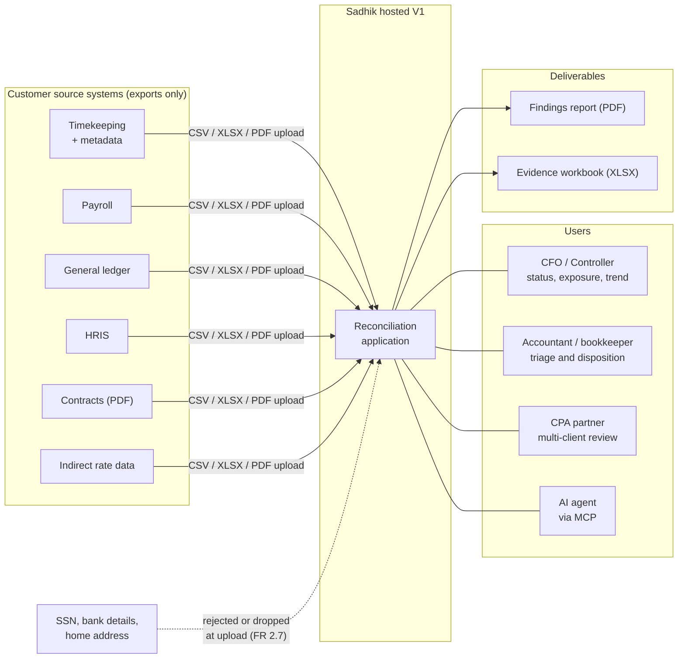
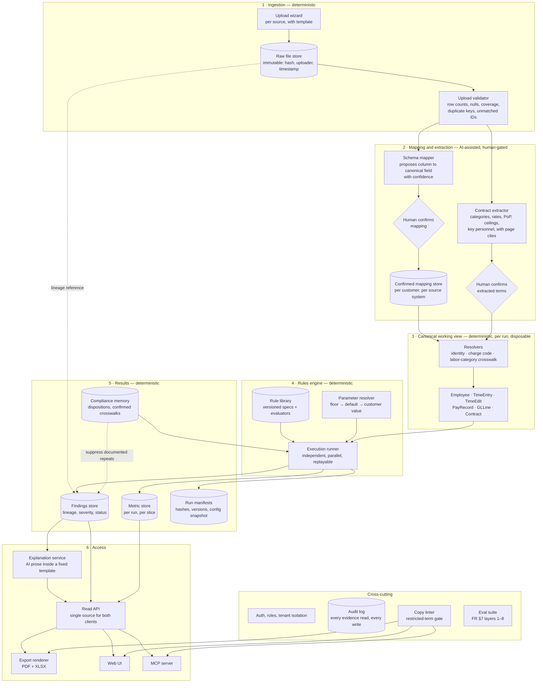
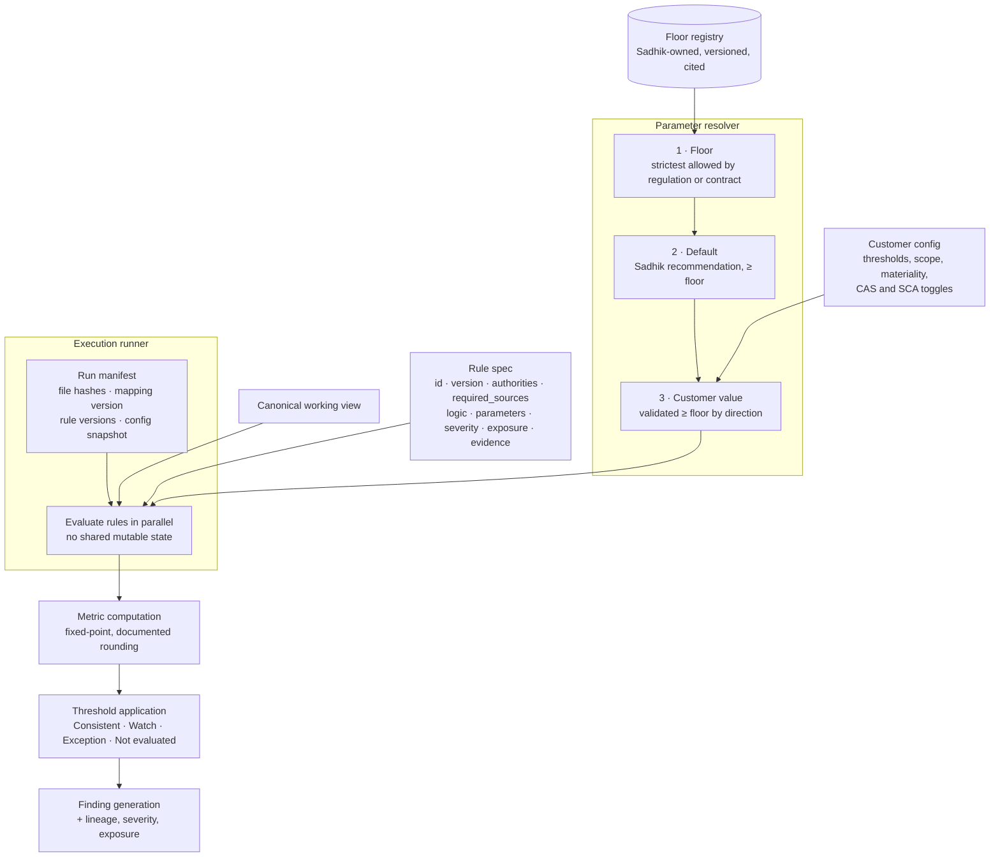
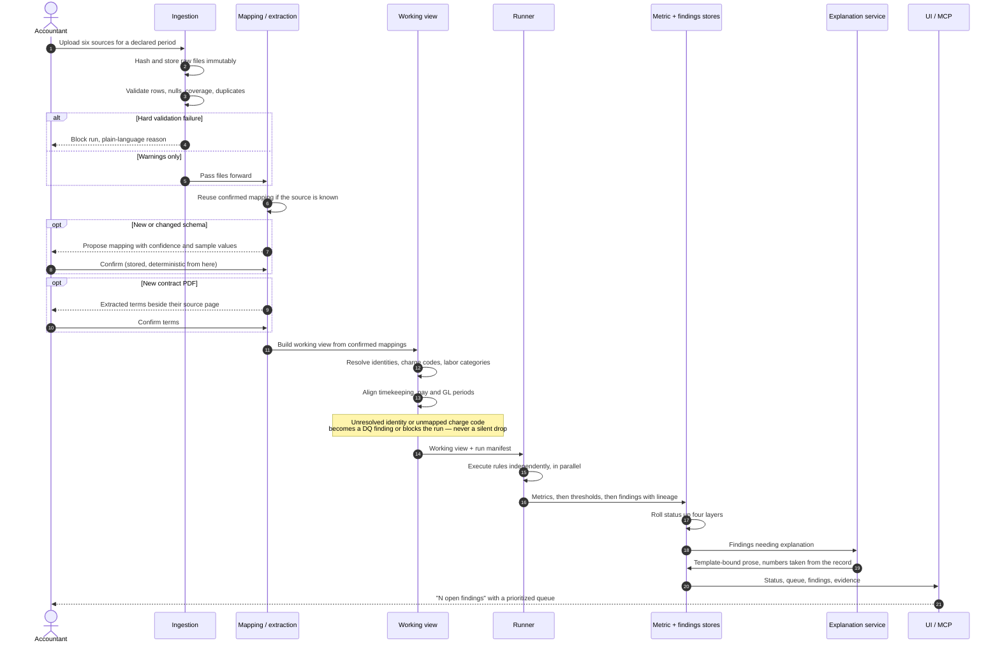
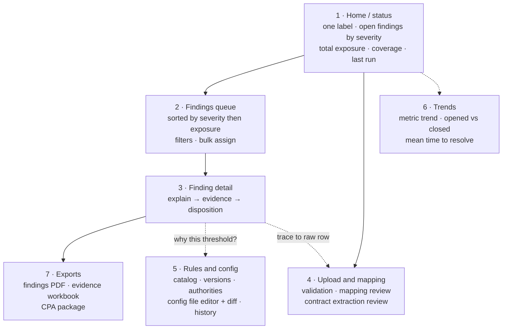
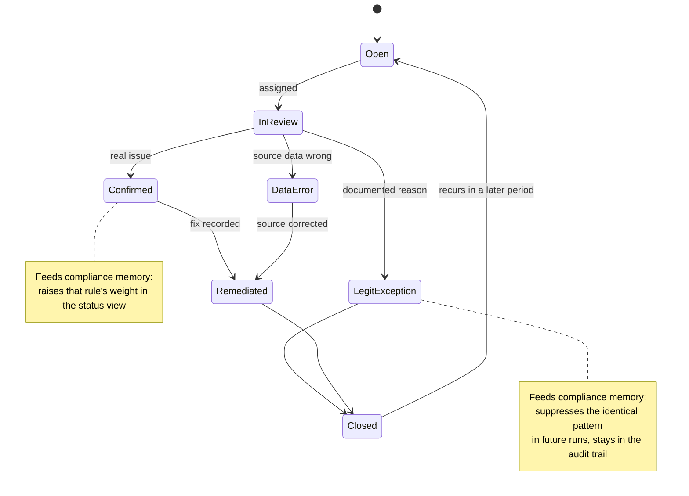
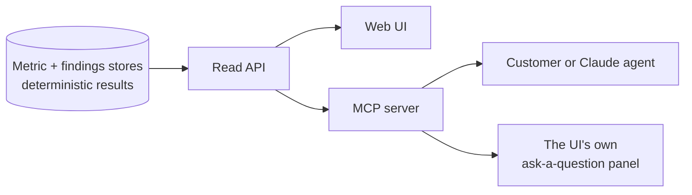
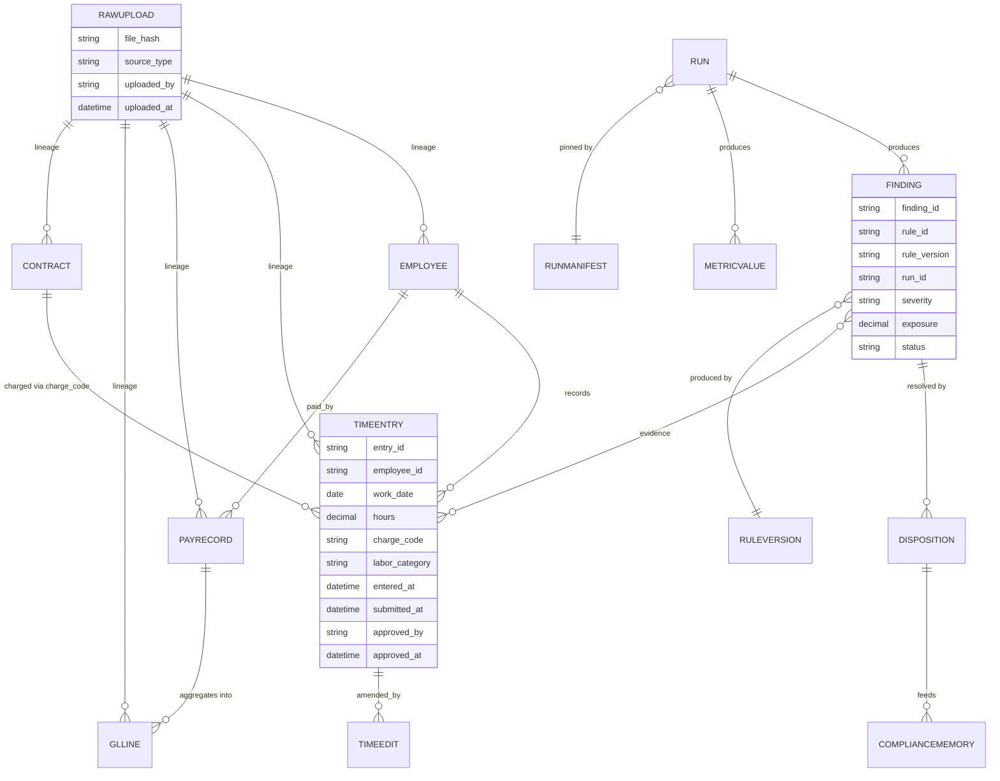
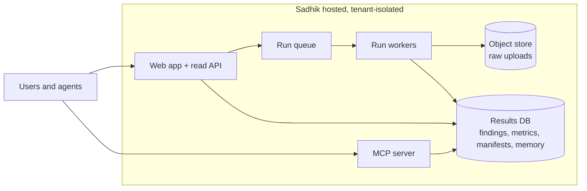

# Sadhik AI — V1 High-Level System Design

**Status:** Draft v0.1 · **Date:** 2026-09-20 · **Owner:** Dev
**Scope:** Labor reconciliation, V1 batch-upload product.

---

## 1. Purpose and how to read this

Sadhik AI V1 ingests exports from a government services contractor's timekeeping,
payroll, general ledger, HRIS and contract systems, runs a versioned library of
deterministic labor checks against them, and returns lineage-tagged **findings** —
what broke, which rule and authority it maps to, the dollars and employees
affected, and the source records as evidence. Two client surfaces read those
findings: a status-first web UI and an MCP server.

This document is the one architecture picture. The source documents each cover a
slice — `rules-engine-design.md` draws the engine alone, the functional
requirements draw a four-box pipeline — but none shows how an upload becomes a
finding, where a human must confirm something before the engine will act on it,
or how the UI and MCP end up reading the same deterministic result. Sections are
traceable: each component names the functional-requirements section that
specifies it, cited as **FR §n**.

**Not in V1, and deliberately absent from every diagram below:** live connectors
and in-environment agents, a persistent all-purpose data model, forward-chaining
or rule-triggers-rule inference, predictive risk scoring, CMMC, proposals, clause
tracking, a FAR database, and audit-package generation.

**Nothing here is built.** The project is pre-software; this is the target V1
shape, and per `SADHIK_TECHNICAL_STATUS.md` §3 the engine is built only after
2–3 concierge runs show which checks produce real findings.

If you would rather read the system by example than by diagram, **§15 works a
fictional customer end to end** — upload, mapping, rule evaluation, the findings
produced, and how one of them renders and is dispositioned.

---

## 2. Design invariants

Eight constraints bind the architecture. Every diagram in this document obeys
them, and a design change that breaks one is a change to the product, not a
refactor.

| # | Invariant | Architectural consequence |
|---|---|---|
| 1 | **Schema-light, not ontology-first** | The canonical layer is a per-run working view, rebuilt and discarded. No system of record. |
| 2 | **Deterministic code does the math** | No model computes a metric, applies a threshold, or decides pass/fail. AI sits strictly upstream of a human gate or downstream of a computed result. |
| 3 | **Export-first ingestion** | Upload wizard and immutable raw-file store are first-class components; no connector runtime exists. |
| 4 | **CUI-tier data stays in the customer boundary** | V1 is hosted over customer-uploaded exports only; the split-plane design is a V2 seam (§13), not a V1 component. |
| 5 | **Every finding carries lineage** | Source file hash, sheet/page, row, rule ID and version, config snapshot, and run ID travel with each finding. The evidence trail is a deliverable. |
| 6 | **No chaining between rules** | Rules read the working view and emit findings. Ordering cannot affect results, so the runner is trivially parallel and a run is replayable. |
| 7 | **Compliance memory compounds per customer** | Reviewer dispositions are stored and fed back into later runs. Nothing crosses a customer boundary in V1. |
| 8 | **Language guardrails are enforced in code** | A copy linter sits in the render path of every UI string, export and MCP text field. It is a component, not a style guide. |

Invariant 8 exists because the restricted terms carry legal meaning. The system
reports whether submitted data is *consistent or inconsistent with a stated
requirement*. It never reports that a company "is compliant," and never emits
"DCAA-approved," "certified," or attestation language (FR §1, FR §8.3).

---

## 3. System context



Read it as: everything enters as a file, nothing is pulled; the four user classes
all read the same computed results; the exports are the customer-facing artifact,
carrying the lineage trail. The dashed edge is the negative case — minimized PII
never enters the system, and the rejection is visible to the uploader rather than
silent.

---

## 4. Application architecture

The full V1 stack. Subgraphs are labelled **deterministic** or **AI-assisted**;
diamond nodes are human confirmation gates that nothing passes unconfirmed.



**Component responsibilities**

| Component | Responsibility | Nature | Spec |
|---|---|---|---|
| Upload wizard | Per-source upload with field checklist and sample template; CSV, XLSX, PDF | Deterministic | FR §2.1 |
| Raw file store | Stores every upload unmodified with hash, uploader, timestamp, source label | Deterministic | FR §2.5 |
| Upload validator | Blocks the run on hard failures, warns otherwise, in plain language | Deterministic | FR §2.4 |
| Schema mapper | Proposes column-to-canonical-field mappings with confidence | **AI**, gated | FR §2.2 |
| Contract extractor | Reads contract PDFs into typed fields beside their source page | **AI**, gated | FR §2.3 |
| Confirmed mapping store | Reuses a once-confirmed mapping deterministically on later uploads | Deterministic | FR §2.2 |
| Resolvers | Identity resolution, charge-code resolution, labor-category crosswalk | Deterministic | FR §3.1–3.3 |
| Working view | Six canonical record types, rebuilt per run from confirmed mappings | Deterministic | FR §3 |
| Rule library | Versioned declarative rule objects bound to pure evaluators | Deterministic | FR §4; RE §5.3 |
| Parameter resolver | Resolves each tunable through floor → default → customer value | Deterministic | RE §5.4 |
| Execution runner | Executes rules independently from a pinned manifest | Deterministic | RE §5.5 |
| Metric / findings stores | Computed values and findings with full lineage and status | Deterministic | FR §5, §6 |
| Compliance memory | Dispositions and confirmed crosswalks reused in later runs | Deterministic | FR §6 |
| Explanation service | Plain-language text inside a fixed what/why/impact/action template | **AI**, templated | FR §8.1 |
| Read API | One query surface; UI and MCP are peer clients of it | Deterministic | FR §9 |
| Copy linter | Rejects restricted terms in any generated UI or export text | Deterministic | FR §8.3 |

`RE` = `rules-engine-design.md`.

Two things to notice in the diagram. First, the only paths into the rules engine
pass through a confirmed mapping or a confirmed contract term — the AI proposals
are dead ends until a human accepts them. Second, the explanation service reads
from the findings store and writes only into the read API's text fields; there is
no edge from any AI component back into metrics, findings or status.

---

## 5. Rules engine



### 5.1 Rule anatomy

The two source documents describe the rule object with different field lists.
Merged, a rule carries:

| Field | Meaning | Source |
|---|---|---|
| `id`, `version` | Stable ID and semantic version; every finding records the version that produced it | both |
| `title` | Human-readable name | FR §4 |
| `domain` | `labor` in V1 | RE §5.3 |
| `authorities[]` | Regulation, clause, or an honest `audit_practice` / `customer_policy` label | both |
| `basis` | `regulatory` · `contract` · `audit_practice` · `customer_policy` | RE §5.3 |
| `required_sources[]` | Missing source ⇒ *Not evaluated*, never *pass* | FR §4.3 |
| `inputs` | Canonical views and fields the evaluator reads | RE §5.3 |
| `logic` / `evaluator` | Pure function of (inputs, resolved parameters) → findings | both |
| `parameters` | Tunable values with defaults and allowed ranges | both |
| `severity_logic` | Maps metric results to High / Medium / Low | FR §4, §6 |
| `exposure_formula` | Dollar exposure calculation for the finding | FR §4 |
| `evidence_fields[]` | Which record fields are returned as evidence | FR §4 |
| `explanation_template` | Fixed what / why / impact / action frame | FR §4, §8.1 |
| `recommended_action` | What the reviewer should do | FR §4 |
| `tests` | Fixtures for pass, boundary, fail and not-evaluated | both |
| `review_status` | Whether a GovCon CPA or advisor has reviewed the citation and interpretation | RE §5.3 |

```yaml
id: L-05
version: 1.2.0
title: Late or reconstructed time entries
authorities: ["DCAA Information for Contractors: timely recording", "SF 1408 timekeeping criterion"]
required_sources: [timekeeping]
parameters:
  late_threshold_hours: {default: 72, min: 24, max: 168}
  cluster_window: {default: "Fri 12:00-24:00", per: "pay_period"}
  cluster_share_flag: {default: 0.40, min: 0.25, max: 0.70}
logic: entry_lag_hours = entered_at - end_of(work_date); flag if > late_threshold_hours
exposure_formula: sum(hours * loaded_cost_rate) over flagged entries
evidence_fields: [entry_id, employee_id, work_date, entered_at, hours, charge_code]
```

### 5.2 Floors and customer thresholds

Each tunable parameter resolves through three layers, and each declares a
`direction` (`lower_is_stricter` or `higher_is_stricter`) so validation compares
strictness rather than raw numbers.

- **Two tiers per rule.** A customer early-warning threshold, adjustable but never
  looser than the floor, and a floor breach that the customer cannot suppress.
- **Not every parameter has a numeric floor.** Binary checks (qualification match,
  GL tie-out) are zero-tolerance; customers may add an earlier warning tier but
  cannot loosen them. Audit-practice checks (late entries, edit clustering,
  day-of-week patterns) have no regulatory number — their baseline is the
  customer's own written timekeeping policy, recorded as `customer_policy`.
- **Scope precedence.** Parameters can be set at global, contract and
  employee-group scope; the strictest applicable value wins.
- **Floor changes are never silent.** When a regulation moves a floor, customer
  values that become invalid are flagged for review, not rewritten.
- **Materiality affects display only.** Sub-threshold deviations are still logged
  with lineage.

Every threshold change is logged with who, when, old and new value, and a
required reason, and needs CFO or Controller approval (RE §5.7). In this design
that log is not a database table — it is the version history of the customer's
config file, specified next.

### 5.3 The rules config file

Customer tuning is a **file the customer changes**, not settings in a database.
The file is the single source of truth: the engine reads nothing else, and the
UI's rules screen (§8.1, screen 5) is an editor over it rather than a form over
a settings table.

The reason is evidence. A threshold history assembled from database audit rows is
something Sadhik asserts. A file diff, signed off and hashed into the run
manifest, is something the customer holds and an auditor can read directly. Since
RE §5.7 requires that every threshold change record who, when, old and new value
and a reason, a versioned file gives that structure for free rather than as a
feature to build.

```yaml
# meridian-rules.yaml
config_version: 7
customer: meridian-systems
effective_from: 2026-09-01
changed_by: a.okafor
approved_by: r.delgado           # Controller; required for any loosening
reason: "Tightened late-entry threshold after August cluster finding F-3312"

schedule:                        # declared intent, measured against run history (§7.3)
  fast: weekly
  pay_period: semi_monthly
  close: monthly

defaults:
  materiality_pct: 0.005
  coverage_floor: 0.85

rules:
  L-05:
    late_threshold_hours: 48     # default 72 → stricter, accepted
    cluster_share_flag: 0.30     # default 0.40 → stricter, accepted
  L-02:
    variance_watch_pct: 0.01
    scope:
      contract:
        C-8841: {variance_watch_pct: 0.005}   # strictest applicable wins
  L-11:
    status: not_applicable
    reason: "No provisional billing rate agreement in place"
```

**What the file cannot express.** The parameter resolver has three layers
(§5.2); the file is only the third. Floors live in Sadhik's registry, versioned
and cited, and the file has no syntax for them. A file that attempts to set a
floor is rejected rather than ignored, so a customer reading their own config can
never believe they have moved one.

| Attempted | Outcome |
|---|---|
| `late_threshold_hours: 48` (default 72) | Accepted — stricter by the parameter's `direction` |
| `late_threshold_hours: 200` | Rejected — exceeds the declared `max: 168` |
| `ceiling_notice_pct: 90` | Rejected — floor is 85, this is looser |
| `floor: 70` on any parameter | Rejected — floors are not customer-settable |
| `enabled: false` on a `regulatory` rule | Rejected — a zero-tolerance check cannot be switched off |
| `status: not_applicable` with a reason | Accepted — different from disabled; appears on the coverage line rather than vanishing |

**Validation is a gate, not an editor.** A customer-authored file is untrusted
input. It is validated against the floor registry on submission, comparing
strictness by `direction` rather than raw magnitude, and a failure returns a
line-level diff naming the value refused and why. A refused value is never
silently clamped to the nearest legal one.

**Binding to a run.** The config file is hashed and pinned in the run manifest
exactly like an input file, so `config_snapshot` is a file hash rather than a
database pointer. Replaying a past run reads that exact file, which means
tightening a threshold today cannot retroactively change what August reported.
Effective-dating falls out of the manifest rather than needing its own machinery.

**Dry-run before adoption.** Because config is a file and a run is replayable, a
proposed diff can be evaluated against the last run's working view before it is
adopted: *tightening L-05 to 48 hours would have opened 4 more findings in
August, worth $6,140.* This is RE §6's sandboxed `run_rule(id, params)` pointed
at a config diff, and it turns threshold-setting from a guess into a measured
decision. The dry run cannot persist anything.

**Where the file lives.** V1 accepts it as an upload alongside the data exports,
consistent with export-first ingestion, and the UI writes it on the accountant's
behalf so no one is required to hand-edit YAML. A customer- or CPA-owned git
repository as the config source is a natural later seam — the engine already
reads a hashed file, so the only change is where the file comes from — but it is
not built in V1.

> **Open item.** Whether cadence belongs in this file or in a separate scheduler
> setting. It is placed here so the manifest pins it and declared-versus-actual
> cadence becomes checkable, but it is operational config rather than a rule
> parameter. See §14.

### 5.4 No chaining, and what that buys

A rule reads the working view and emits zero or more findings. It cannot trigger
another rule, and no rule sees another's output. Consequences: the runner
parallelizes without coordination, rule order is untestable because it is
irrelevant, and a single rule can be reasoned about and reviewed by a CPA in
isolation. The engine is revisited only if rule count and interdependence grow
substantially — a rough guide of 50 to 100 interdependent rules (RE §3.1).

### 5.5 Reproducibility

A run manifest pins input file hashes, mapping version, rule versions and a
config snapshot. Re-executing a stored manifest reproduces identical findings to
the cent. This is what makes a past finding defensible months later, and it is
tested directly (FR §7 layer 3).

### 5.6 Rule catalog

V1 ships L-01 through L-13 plus data-quality gates DQ-01 to DQ-05, specified in
FR §4 with their authorities and required sources; the 14 metrics they compute
are in FR §5. Both are referenced rather than restated here, so there is one
authoritative copy.

Concierge-phase ordering is L-01, L-02, L-03, L-05, L-06, L-09 first — the checks
reachable from the two highest-value sources (timekeeping metadata and payroll).
Rules that never produce a confirmed, previously unknown finding across the
design partners are cut or reworked before V1 builds them.

> **Open item.** `SADHIK_TECHNICAL_STATUS.md` §5 numbers seven checks L1–L7;
> the functional requirements number thirteen L-01–L-13. They are not the same
> scheme. See §13.

---

### 5.7 Compliance domains

A **domain** is a property of the rule, not of the customer's data. Each `RuleSpec` carries `domain`
(`labor`, `dcaa_cost_accounting`), and the customer's config file says which domains they run:

```yaml
domains: [labor, dcaa_cost_accounting]   # default when absent: [labor]
```

- **A disabled domain is not run.** Its rules are not executed and do not appear in the results, so they are
  not "Not evaluated": the customer did not ask for them. A labor-only customer therefore never sees a
  permanent "Incomplete data" because a second domain has no sources.
- **Each enabled domain has its own rollup** (open findings, severity, coverage, label), and the run also has an
  overall one. Overall counts and coverage are summed across enabled domains, M13 exposure is de-duplicated
  across them, and the overall label is **"Incomplete data" if any enabled domain is below the coverage
  floor**. Thin data in one domain must not let the overall status read clean (invariant 2).
- **Coverage counts checks, not gates.** `RuleSpec.counts_toward_coverage` replaces an earlier shortcut that
  treated the `L-` id prefix as "labor" and "counts toward coverage" at once. Data-quality gates (DQ-*) raise
  findings but are not rules evaluated.
- **Rule IDs did not change.** L-08 and L-11 keep the IDs from the functional requirements' catalog, which
  lists them under labor. They are tagged `dcaa_cost_accounting` here; see §14 #9.
- **Domains are hashed with the rest of the config** (§5.5), so replaying a run reproduces which domains ran.

---

## 6. The reconciliation process, end to end



### 6.1 Status rollup

Status is computed in four layers, each the worst case of the layer below
(FR §6):

1. **Metric result** — value against Watch and Exception thresholds, giving
   *Consistent*, *Watch*, *Exception* or *Not evaluated*.
2. **Rule result** — worst metric result for that rule. A rule missing a required
   source is *Not evaluated*. An Exception, or a Watch above the materiality
   floor, creates a finding.
3. **Requirement result** — each authority takes the worst result among its
   mapped rules, plus a coverage figure ("4 of 6 mapped rules evaluated").
4. **Domain and overall** — the Labor domain rolls up requirement results. The
   top-level label is "No open findings," "N open findings" with a high-severity
   count, or **"Incomplete data"** — which takes precedence over an otherwise
   clean result whenever coverage falls below the configured floor.

That precedence rule is the architectural expression of invariant 2: thin data
must never read as a good result.

### 6.2 Failure and edge behavior

| Situation | Behavior |
|---|---|
| A required source is missing | Rule returns *Not evaluated*. Never *pass*. |
| Fewer than 3 prior periods of history | Metric still computed; threshold falls back to a conservative default and the finding is marked *low baseline confidence*. |
| Deviation below the materiality floor | Logged with full lineage; no finding raised. |
| One entry trips two rules | Dollars count once in total exposure (M13); the finding view shows both rule hits. |
| Duplicate upload of the same file | Idempotent — same hash, no duplicate findings. |
| Unmatched employee across systems | Data-quality finding, not a silent drop. |
| Unmapped charge code | Blocks the run. |

---

## 7. Run cadence and continuity

Sadhik calls itself a continuous reconciliation harness. A harness is a fixture
that wraps a system under test, drives it with inputs, and keeps asserting
invariants against it. Sections 5 and 6 build the assertion set and the driver.
This section is what makes it continuous rather than a batch report someone
remembers to run.

### 7.1 Cadence is set by the slowest source, unless runs are tiered

A run needs the sources its rules require, and those sources become available at
different times. Timekeeping can be exported any day. Payroll lands at each pay
period close. The general ledger is not ready until the books close for the
month. If every run demands the full six-source bundle, the GL close sets the
cadence for everything — including the checks that decay fastest.

Nothing in the engine requires that bundling. Rules are independent (§5.4) and a
rule missing a required source returns *Not evaluated*, never *pass* (§6.2). A
run over one source is therefore already well-defined; it simply was not named
as a mode. Naming it gives three tiers, which fall directly out of each rule's
`required_sources`:

| Tier | Cadence | Sources | Rules evaluated | Why this cadence |
|---|---|---|---|---|
| **Fast** | Weekly | Timekeeping + edit log (contracts already confirmed) | L-05, L-06, L-07, L-09, L-10, L-12 | These decay fastest and cost one export. A bad charge code caught in week one is a correction; caught after close it is an invoice adjustment |
| **Pay period** | Per pay period (weekly, biweekly or semi-monthly, per the customer) | + Payroll, HRIS | + L-01, L-02, L-04, L-13 | Time-to-pay agreement cannot be tested before payroll runs |
| **Close** | Monthly | + GL, indirect rate data | + L-03, L-08, L-11 | Labor dollars cannot tie to the GL before the GL closes |

Each tier is a normal run: same working view construction, same manifest, same
findings store, same lineage. A fast-tier run pins a manifest that records which
sources were absent, so its coverage figure is honest and its unevaluated rules
are visible rather than implied.

The worked example shows what the tiering is worth. Meridian's out-of-PoP charges
were recorded 2026-08-17 through 08-21 and the monthly run executed 2026-09-03 —
a detection lag of 13 to 17 days, by which point the August invoice had gone out.
L-09 needs only timekeeping and confirmed contract terms. At fast-tier cadence it
fires inside the same week.

### 7.2 What tiering costs

Two consequences, both of which are design decisions rather than side effects.

**Baselines must be pinned to a period type, not a run count.** M5's cluster index
divides this period's share by the mean of the trailing 6 periods. With mixed
cadences, "the last 6 runs" and "the last 6 periods" stop being the same thing.
Every trailing-window metric therefore declares the period type it accumulates
over (`pay_period` for M5 and M6, `month` for M10), and a fast-tier run
contributes to the window for its period without closing it. A period's baseline
value is final only once its close-tier run has executed.

**Status has to distinguish "clean this week" from "not checked since close."**
A fast-tier run that finds nothing must not render the same as a full run that
finds nothing. The status page therefore carries per-tier state, not one label:

```
8 open findings · 3 high · $41,298.93 exposure

  Fast tier      ran 2026-09-14   6 of 6 rules      ✓ current
  Pay period     ran 2026-09-01   4 of 4 rules      ⚠ next due 2026-09-16
  Close tier     ran 2026-09-03   2 of 3 rules      ⚠ L-11 not evaluated — no rate data
                                                      August books; September closes 2026-10-03
```

### 7.3 Staleness, due dates and notification

A harness knows what it has not checked lately. Three mechanisms, none of which
needs a live connector:

1. **Declared cadence.** The customer's config file declares an intended cadence
   per tier (§5.3). This is a statement of intent, and the gap between it and the
   run history is itself reportable: *declared weekly, last fast-tier run 34 days
   ago.* Nothing enforces it in V1 — no connector means no ability to run
   unattended — but an undeclared cadence cannot be measured at all.
2. **Data staleness, separate from run staleness.** A run executed yesterday over
   an export pulled three weeks ago is stale data in a fresh run. Every source
   carries `data_as_of` from its upload, and the status page reports the oldest,
   because that is what bounds how current any finding can be.
3. **Notification on state change, not on schedule.** A new high-severity finding,
   a rule that flips from evaluated to *Not evaluated*, a coverage drop below the
   floor, or a missed declared cadence each notify. A run that changes nothing
   does not. This keeps the signal tied to what a reviewer would want to
   interrupt their day for, and it is the only path in the design from a finding
   to someone's attention — without it, findings wait in a queue to be visited.

### 7.4 What "continuous" honestly means in V1

Export-first ingestion (invariant 3) bounds this. A human pulls the exports, so
V1 is *periodic on a declared cadence*, not continuous in the literal sense, and
nothing in the UI or in any export should claim otherwise. What V1 can deliver is
a short and known interval, a visible next-run-due, and honest staleness — which
is the difference between a tool someone remembers to run and one they experience
as watching.

V2's in-boundary agent collapses the fast tier toward continuous by removing the
human from the export step. The pay-period and close tiers stay periodic even
then, because payroll and the GL are themselves periodic events. That ceiling is
a property of the domain, not of the architecture.

---

## 8. Interacting with findings

The UI answers "what is wrong and what do I do about it," in that order. Charts
appear only as supporting evidence beneath a plain-language explanation, and no
screen requires interpreting a chart to know whether something is wrong.

### 8.1 Screen map



Home is the only screen a CFO needs. The accountant lives in the queue and the
detail view. Trends sits one click away and is deliberately secondary — it
describes direction, not state.

### 8.2 Finding detail: the mandated order

```
┌────────────────────────────────────────────────────────────────┐
│ a · WHAT HAPPENED            plain language, no jargon         │
│ b · WHY IT MATTERS           authority cited, from the rule    │
│ c · IMPACT                   dollars · employees · contracts   │
│ d · RECOMMENDED ACTION       what the reviewer should do next  │
├────────────────────────────────────────────────────────────────┤
│ e · EVIDENCE                 source records: file, sheet, row, │
│                              timestamps + supporting chart     │
├────────────────────────────────────────────────────────────────┤
│ f · DISPOSITION              confirmed · legitimate exception  │
│                              · data error  (+ reason, attach)  │
│ g · HISTORY                  every transition: who, when, note │
├────────────────────────────────────────────────────────────────┤
│ h · ASK A QUESTION           agent panel over the MCP tools    │
└────────────────────────────────────────────────────────────────┘
```

Blocks a–d are generated inside a fixed template; the model may write prose only
from fields present in the finding record, and every figure it states comes from
the engine. Block e is where charts are allowed. Every number in a–c is drillable
to its underlying records in at most two clicks, showing the raw file, sheet and
row.

### 8.3 Finding lifecycle



Every transition records user, timestamp and note. Closed findings stay in the
audit trail and reopen automatically if the same condition recurs. A legitimate
exception requires a reason code and accepts an attachment, such as a signed
correction memo. Repeated data errors on the same source trigger a
mapping-review prompt.

Nothing in compliance memory crosses a customer boundary in V1.

### 8.4 Roles

| Role | May do |
|---|---|
| Admin | Everything, including threshold changes and user management |
| Reviewer | Disposition findings, add notes and attachments, run checks |
| Viewer | Read status, findings and evidence |
| CPA Partner | Multi-client read plus review, limited to clients that granted access |

Every action — including every read of evidence — is written to the audit log.

### 8.5 The conversational panel

The "ask a question" panel is not a second system. It is an agent calling the
same MCP tools described in §9, over the same stored results. The agent narrates
and cites; the engine supplies every number. Free-text from source records
(timesheet notes, memos) reaches the agent inside delimited, explicitly untrusted
fields, and prompt-injection cases are tested with a zero-tolerance gate
(FR §7 layer 8).

---

## 9. MCP as a peer interface



The architectural point: the UI and the MCP server are peer clients of one read
API. There is no second calculation path, and no tool computes or overrides a
status, metric or exposure with a model.

| Access | Tools |
|---|---|
| Read | `get_status` · `list_findings` · `get_finding` · `get_evidence` · `get_metric` · `list_rules` / `get_rule` · `get_data_coverage` · `query_records` · `compare_periods` |
| Write | `run_checks` (async) · `disposition_finding` (Reviewer) · `upload_source` (mapping still needs human confirmation) |

Full signatures are in FR §9. Resources are exposed as `finding://{id}`,
`rule://{id}@{version}` and `run://{id}`.

**Rules the server enforces:** OAuth mapped to the UI roles; every call scoped to
one customer, or for a CPA partner one granted client per call; writes preview
before they commit and require explicit confirmation; every response carries
record IDs, file hashes and rule versions so an agent can cite exactly where a
fact came from; pages are bounded with cursors and large evidence sets point at
an export; tool schemas are versioned and the agent eval runs against the server
on every release.

`query_records` takes parameterized filters over canonical record types. It does
not accept free-form SQL.

---

## 10. Trust boundary: where AI is allowed

Every AI touchpoint in the system, with its gate, its eval and its fallback. This
table is the answer to "can the model ever move a number?" — it cannot.

| Touchpoint | The model may | Human gate | Eval (FR §7) | Fallback when the eval degrades |
|---|---|---|---|---|
| Schema mapping | Propose column-to-field mappings with confidence | Confirmed once, then deterministic | Layer 4 — top-1 accuracy ≥ 90% on required fields | Fully manual mapping |
| Contract extraction | Read PDFs into typed fields with page citations | Confirmed before rules use the values | Layer 5 — field F1 ≥ 0.90 on rates, PoP, categories | Manual entry of contract terms |
| Explanation | Write prose inside a fixed template, from fields present in the record | Template + copy linter | Layer 6 — 100% figure match, zero restricted phrases | Fixed template, no generated prose |
| Threshold suggestion | Explain a baseline and propose a value | Passes the same validator as any customer value; no write access to floors | Layer 7 | Defaults only |
| Investigate / Q&A | Call read-only tools and narrate results with citations | Read-only tools; every answer cites finding and record IDs | Layers 7 and 8 — correct tool ≥ 95%, zero ungrounded numbers | Panel disabled; queue and detail unaffected |
| Draft rules from regulation text (offline) | Extract candidate IF-THEN logic into a validated schema | SME review before the rule enters the library; never at runtime | n/a — offline | Hand-authored rules |

Low-confidence output from any touchpoint routes to a human rather than
proceeding. All model output passes typed-schema validation.

---

## 11. Data model sketch

The six canonical types are a **per-run working view**, not a persistent
ontology — they are rebuilt from confirmed mappings each run and discarded. Only
the results side is durable.



Field lists are abbreviated to the ones that carry lineage or drive a rule; the
complete canonical field set is FR §3. Every canonical record carries source file
hash, sheet or page, and row number, which is what makes the `FINDING → evidence`
edge resolvable back to a raw cell.

---

## 12. Non-functional requirements

| Area | Requirement | Architectural implication |
|---|---|---|
| Security | Encryption in transit and at rest; per-tenant isolation; audit log for every evidence read and every write; SOC 2 readiness planned; FedRAMP 20x deferred until funded | Audit log is a first-class store, not application logging |
| Data handling | No SSNs, bank details or addresses ingested; customer-controlled deletion; raw uploads retained per the customer's retention setting | Rejection happens at upload, visibly; deletion must cascade to derived data |
| Reproducibility | Any past run re-executes from stored inputs, rule versions and mappings and produces identical findings | Run manifest and immutable raw store are load-bearing, not conveniences |
| Scale (V1 target) | 500 employees, 24 periods, 2M time entries per customer; full run under 10 minutes | Parallel runner; the no-chaining invariant is what makes this cheap |
| Explainability | Every finding traces headline → rule → metric → records → raw file | Lineage cannot be optional on any path |
| Availability | Batch product: 99.5% for UI and MCP; runs are queued and resumable | Runs are jobs, not request-scoped work |
| Performance | Status page under 2 seconds at full scale; WCAG 2.1 AA; status never conveyed by color alone | Status is precomputed at run time, not on page load |

---

## 13. Deployment and the V2 seam

### 13.1 V1



One hosted deployment over customer-uploaded exports. Runs are queued and
resumable. Raw files live in an object store; everything computed lives in the
results database.

### 13.2 Future boundary — not designed here

**V2** moves ingestion into the customer's environment: an in-boundary agent with
live sync, where CUI-tier source data never leaves the customer's boundary or
GovCloud tenant and only findings and minimal metadata return to the hosted
layer. **V3** adds per-customer, then pooled, predictive risk scoring, only after
real outcome data exists.

The seam V1 must not foreclose is the **read API contract and the findings
schema**. If findings are the only thing that crosses the boundary, and both the
UI and MCP already read findings through one API, then V2 swaps what sits
upstream of the findings store without touching anything downstream of it. That
is the single design constraint V1 owes to V2; nothing else about V2 should be
built or assumed now.

---

## 14. Open questions carried forward

Architecture-relevant items still unresolved. The first four are recorded in the
source documents; the rest are raised by writing this one.

| # | Question | Source |
|---|---|---|
| 1 | Rule authoring format for V1: pure Python, or Python plus a declarative spec (JSON Logic / YAML) for non-engineer editing? | RE §10.2 |
| 2 | Tenancy and storage model for findings and config snapshots once hosted | RE §10.3 |
| 3 | Hosted vs. in-boundary MCP for the first customer with CUI-tier timekeeping data | FR §10 |
| 4 | Does timekeeping metadata come in exports at all, or does it need a separate audit-log report? L-05, L-06 and L-07 depend on it, and the answer changes how much of §5 is buildable | FR §10 |
| 5 | **Rule ID scheme.** `SADHIK_TECHNICAL_STATUS.md` §5 uses L1–L7; the functional requirements use L-01–L-13. One scheme needs to win before any rule file is written, since the ID appears in every finding record. The build follows the functional requirements' IDs, and §5.7 now separates the domain from the ID, but the question is not closed | new |
| 6 | **Top-level label.** Two documents use "Audit-Ready" as the example status; FR §1 requires a non-certifying phrase and recommends replacing it. Until resolved, the copy linter has an ambiguous input | new |
| 7 | **CPA partner as a role vs. a channel.** The CPA Partner role in §8.4 comes from the functional requirements, while open decision D1 in the status document treats direct-to-contractor as the current GTM. The role is cheap to build and harmless to defer — but it should be a decision, not an accident | new |
| 8 | **Cadence placement.** The run schedule sits in the customer's config file (§5.3) so the manifest pins it and declared-versus-actual cadence is checkable. But it is operational config, not a rule parameter, and a customer who wants a different cadence per contract has no way to say so today | new |
| 9 | **Domain of L-08 and L-11.** The functional requirements' catalog lists both under labor; the build tags them `dcaa_cost_accounting` because they test cost-accounting structure (pools, bases, classification) and not time and pay. The cost is that labor coverage reads 6 of 6 and not 6 of 7. If the catalog is right, the domain tiles need rethinking | new |
| 10 | **L-08 sources and history.** The functional requirements list the GL as an input; the build uses timekeeping plus seeded per-employee history, so it runs at the fast tier. Real multi-period history should come from stored runs, which is a larger change than the single-period demo | new |
| 11 | **Contract-scoped threshold overrides are accepted but not applied.** The config validator checks them against the floors and warns, but no rule reads a per-contract value yet. Either wire them into the rules that iterate per contract or reject them | new |
| 12 | **The `C-` rule IDs.** C-01, C-02 and C-03 have no counterpart in the functional requirements' catalog, so they take a new prefix and stay in the DCAA domain. That makes the ID scheme (#5) three-way: the status document's `L1–L7`, the catalog's `L-01–L-13`, and `C-` for cost accounting. Worth settling before more rules are added | new |
| 13 | **Allowability is a table the customer confirms, not something the engine infers.** That is deliberate (the engine never decides whether a cost is allowable), but it moves a lot of judgement into one file. Who owns it, how it is reviewed, and whether Sadhik ships a starting version are open | new |
| 14 | **As-of date for date-based rules.** C-02 uses the last day of the run period so the engine never reads a clock and a run stays replayable. A customer who wants "overdue as of today" would need a declared as-of date in the run manifest | new |

---

## 15. Appendix A — Worked example: Meridian Systems, August 2026

A fictional customer, carried from upload through to rendered findings. Every
number below is arithmetically consistent with the formulas in FR §5 and the
thresholds in FR §6, so the example doubles as a hand-check of the engine's
behavior. Names, IDs and figures are invented.

### 15.1 The customer

**Meridian Systems LLC** — IT and data engineering services contractor,
142 active employees, ~$48M revenue, fiscal year ending 31 December.
Timekeeping in Unanet, payroll in ADP, GL in QuickBooks with a GovCon add-on,
HRIS in BambooHR. Two contracts carry cost-type or T&M exposure:

| Contract | Type | Period of performance | Value | Notes |
|---|---|---|---|---|
| C-8841 "SPECTRA" | T&M | 2025-10-01 → 2026-09-30 | $6,000,000 ceiling, $4,200,000 funded | 11 labor categories with ceiling rates |
| C-7302 "ATLAS" | CPFF | 2025-08-16 → **2026-08-15** | $3,150,000 | Option year not yet exercised at run time |

Indirect charge codes: `OH-100` overhead, `GA-200` G&A, `FR-050` fringe,
`BP-300` B&P, `LV-010` leave.

**Run period:** August 2026 (2026-08-01 → 2026-08-31), 21 working days,
168 standard hours. This is Meridian's 7th monthly run, so trailing-baseline
metrics have the 6 prior periods they need.

### 15.2 What was uploaded

| Source | File | Rows | Validation |
|---|---|---|---|
| Timekeeping | `meridian_time_2026-08.csv` | 4,120 entries | Pass |
| Timekeeping edit log | `meridian_time_edits_2026-08.csv` | 148 edits | Pass |
| Payroll | `adp_payroll_2026-08.xlsx` | 284 rows (2 semi-monthly periods × 142) | Pass |
| General ledger | `qb_gl_2026-08.csv` | 1,806 lines | Pass |
| HRIS | `bamboo_roster_2026-08-01.csv` | 146 (142 active, 4 terminated) | **Warning** — 4 timekeeping employee IDs absent |
| Contracts | `C-8841.pdf`, `C-7302.pdf` | 2 documents | Pass (extraction confirmed, see 14.4) |
| Indirect rate data | *not uploaded* | — | Missing — L-11 cannot run |

The HRIS warning does not block the run. Four employees onboarded after the
roster export was taken become a DQ-01 finding rather than a silent drop (FR §3.1).

### 15.3 Mapping (AI proposes, human confirms)

Meridian's Unanet export was new to the system, so the schema mapper ran. It
proposed 19 field mappings; 14 cleared the auto-accept confidence bar and 5 were
routed to the accountant:

| Source column | Proposed canonical field | Confidence | Outcome |
|---|---|---|---|
| `Person Code` | `employee_id` | 0.98 | Auto-accepted |
| `TS Date` | `work_date` | 0.97 | Auto-accepted |
| `Charge` | `charge_code` | 0.91 | Auto-accepted |
| `Created On` | `entered_at` | 0.74 | **Routed** — confirmed |
| `Mod By` | `editor_id` | 0.68 | **Routed** — confirmed |
| `Appr Dt` | `approved_at` | 0.71 | **Routed** — confirmed |
| `PLC` | `labor_category` | 0.63 | **Routed** — confirmed (PLC = "Project Labor Category") |
| `Sub Dt` | `work_date` | 0.55 | **Routed — corrected** by the accountant to `submitted_at` |

The last row is the gate earning its keep: an unconfirmed mapping of `Sub Dt` to
`work_date` would have silently broken every timeliness calculation in L-05. Once
confirmed, the whole mapping is stored against "Unanet — Meridian" and applied
deterministically on every later upload. It is not re-proposed.

### 15.4 Contract extraction (AI proposes, human confirms)

The extractor read C-8841 into typed fields, each shown beside its source page:

| Field | Extracted | Page | Outcome |
|---|---|---|---|
| `contract_type` | T&M | p.1 | Confirmed |
| `pop_start` / `pop_end` | 2025-10-01 / 2026-09-30 | p.3 | Confirmed |
| `labor_categories[]` | 11 categories with ceiling rates | p.12 table B-1 | Confirmed |
| `ceiling` | $4,200,000 | p.12 | **Corrected** to $6,000,000 — the extractor read the funded value as the ceiling |
| `funded_value` | *(not found)* | — | **Entered manually** as $4,200,000 |

Two of the 11 categories that matter later:

| Category | Ceiling rate | Minimum qualification |
|---|---|---|
| Data Engineer II | $142.00 / h | BS + 3 years |
| Data Engineer III | $178.50 / h | BS + 7 years |

### 15.5 Working view and resolution

The runner rebuilt the six canonical record types from the confirmed mappings:

| Record type | Count | Resolution notes |
|---|---|---|
| `Employee` | 146 | 4 timekeeping IDs unmatched → DQ-01 |
| `TimeEntry` | 4,120 | 4,120 charge codes resolved, 0 unmapped (an unmapped code would block the run) |
| `TimeEdit` | 148 | Linked to 139 distinct entries |
| `PayRecord` | 284 | 23,856 total paid hours (142 × 168) |
| `GLLine` | 1,806 | Split direct / OH / G&A / fringe |
| `Contract` | 2 | With confirmed category tables |

Labor-category crosswalk, confirmed by Meridian in a prior period, maps HRIS
titles to contract categories: `"Sr. Data Engineer" → "Data Engineer III"`,
`"Data Engineer" → "Data Engineer II"`, and 14 others. Confirmed crosswalks
persist as compliance memory.

Period alignment: ADP's two semi-monthly pay periods and QuickBooks' calendar
month were aligned to the August calendar; no partial-period proration was needed
because both pay periods fall inside the month.

### 15.6 The run manifest

```yaml
run_id: RUN-2026-08-MER-001
customer: meridian-systems
period: {start: 2026-08-01, end: 2026-08-31, type: month}
executed_at: 2026-09-03T14:22:07Z
inputs:
  - {source: timekeeping, file: meridian_time_2026-08.csv,   sha256: 9f3c1a7e...}
  - {source: time_edits,  file: meridian_time_edits_2026-08.csv, sha256: 2b81d40c...}
  - {source: payroll,     file: adp_payroll_2026-08.xlsx,    sha256: c47e9b12...}
  - {source: gl,          file: qb_gl_2026-08.csv,           sha256: 55a0f8d3...}
  - {source: hris,        file: bamboo_roster_2026-08-01.csv, sha256: e19b6c44...}
  - {source: contracts,   files: [C-8841.pdf, C-7302.pdf],   sha256: [7d2a..., 4c90...]}
mapping_versions: {unanet_meridian: 3, adp_meridian: 2, qb_meridian: 2, bamboo_meridian: 1}
rule_versions: {L-01: 1.4.0, L-02: 1.1.0, L-03: 1.0.2, L-05: 1.2.0, L-06: 1.3.1,
                L-07: 1.0.0, L-08: 1.1.0, L-09: 1.2.0, L-10: 1.0.1, L-12: 1.0.0}
config_file: {file: meridian-rules.yaml, config_version: 6, sha256: 6a1f0b95...}
tier: close                       # full six-source run (§7.1)
declared_schedule: {fast: weekly, pay_period: semi_monthly, close: monthly}
materiality_basis: 1986240.00   # period labor cost, USD
materiality_pct: 0.005          # → $9,931.20
```

Re-executing this manifest reproduces the findings below to the cent. That is the
reproducibility claim in §5.5, and it is what makes a finding defensible when a
reviewer opens it eight months later.

### 15.7 What the rules computed

Rules ran independently and in parallel. Results, worst-case rolled up per §6.1:

| Rule | Metric | Computed value | Threshold | Result |
|---|---|---|---|---|
| L-01 Labor category | M3 mismatch rate | 12 / 4,120 = **0.29%** | Any unapproved category billed on T&M ⇒ Exception | **Exception** |
| L-02 Hours vs. pay | M1 variance | 342 / 23,856 = **1.43%** | Watch > 1%, Exception > 3% | Watch |
| L-02 Hours vs. pay | M1 per-employee gap | max **12.0 h** (E-0912) | Exception if any gap > 8 h | **Exception** |
| L-03 Payroll vs. GL | M2 dollar variance | $2,138.00 / $1,986,240.00 = **0.11%** | Watch > 0.5% | Consistent |
| L-05 Entry timeliness | M4 late-entry rate | 214 / 4,120 = **5.19%**, p90 lag 5.2 d | Watch > 5%, Exception > 15% or p90 > 7 d | Watch |
| L-05 Entry clustering | M5 cluster index | 0.38 / 0.14 = **2.71** | Watch > 1.5, Exception > 2.5 | **Exception** |
| L-06 Post-submission edits | M6 edit rate | 148 / 4,120 = **3.59%**; undocumented 9 / 148 = 6.1%; last-2-days 41% | Watch > 3%; Exception if undocumented > 10% or last-2-days > 50% | Watch |
| L-07 Approval integrity | M7 exception rate | **0.00%** | Exception on any self-approval | Consistent |
| L-08 Direct/indirect | M9 classification drift | 0 codes | Zero tolerance | Consistent |
| L-09 Assignment / PoP | M8 out-of-PoP | **62 h**, 3 employees on C-7302 | Any charge outside PoP ⇒ Exception | **Exception** |
| L-10 Impossible hours | — | 0 | Zero tolerance | Consistent |
| L-11 Indirect rate drift | M10 | — | — | **Not evaluated** (no rate data) |
| L-12 Ceiling / key personnel | — | 68.2% of funded value | Watch at 80% | Consistent |
| L-13 SCA wage floor | — | — | — | Not applicable (52.222-41 absent from both contracts) |
| DQ-01 | M12 coverage | 11 of 12 applicable rules = **91.7%** | Floor 85% | Above floor |

Two things the table demonstrates. **L-02**: the headline variance of 1.43% is only
a Watch, but a single employee-period gap of 12 hours trips the Exception
condition, and the rule result is the worst of its metrics — a good percentage
does not bury a bad record. **L-05**: the late-entry rate is unremarkable while the
clustering index is not, and again the worst metric wins.

Because coverage (91.7%) sits above the configured floor, "Incomplete data" does
not take precedence, and the run produces a findings status rather than a data
status.

### 15.8 Findings produced

Eight open findings. Severity per FR §6: **High** = an Exception with exposure at
or above materiality ($9,931.20), or a systemic pattern (3+ periods or 5+
employees), or an integrity failure.

| ID | Rule | Headline | Exposure | Employees | Severity |
|---|---|---|---|---|---|
| F-3311 | L-01 | Data Engineer III billed on C-8841 for an employee crosswalked to Data Engineer II | $3,504.00 | 1 | **High** — integrity |
| F-3312 | L-05 | Entry-time clustering on C-7302 team at 2.7× the 6-period baseline | $27,518.40 | 9 | **High** — systemic + exposure |
| F-3313 | L-09 | 62 hours charged to C-7302 after its period of performance ended 2026-08-15 | $5,852.40 | 3 | **High** — integrity |
| F-3314 | L-02 | Timekeeping exceeds paid hours by 12.0 h for E-0912 | $1,156.80 | 1 | Medium |
| F-3315 | L-02 | Timekeeping exceeds paid hours by 8.0 h for E-1104 | $705.60 | 1 | Medium |
| F-3316 | L-02 | Paid hours exceed timekeeping by 9.5 h for E-0733 | $976.13 | 1 | Medium |
| F-3317 | DQ-01 | 4 timekeeping employee IDs not present in the HRIS roster | — | 4 | Medium |
| F-3318 | L-06 | Edit rate 3.59%, with 9 edits lacking a reason code | $4,199.80 | 6 | Low |

**Total exposure (M13), de-duplicated:**

```
  F-3311    3,504.00
  F-3312   27,518.40
  F-3313    5,852.40
  F-3314    1,156.80
  F-3315      705.60
  F-3316      976.13   ← 9.5 h × $102.75 = 976.125, rounded half-up per the documented rule
  F-3318    4,199.80
           ──────────
           43,913.13
  less overlap:
   −1,644.00  E-0455's 16 out-of-PoP hours also fall in F-3312's cluster window
     −970.20  2 undocumented edits sit on entries already counted in F-3312
           ──────────
  M13      41,298.93
```

The de-duplication is the rule from FR §5.5: an entry caught by two rules
contributes its dollars once to total exposure, while both findings remain
visible and both show the shared record in evidence.

**Top-level status:** `8 open findings` · 3 high severity · $41,298.93 total
exposure · coverage 11 of 12 applicable rules.

```
  Fast tier      ran 2026-09-03   6 of 6 rules   ⚠ declared weekly — 0 runs since
  Pay period     ran 2026-09-03   4 of 4 rules   ⚠ next due 2026-09-16
  Close tier     ran 2026-09-03   2 of 3 rules   ⚠ L-11 not evaluated — no rate data
  Oldest source  bamboo_roster_2026-08-01.csv    data as of 2026-08-01 (33 days)
```

This is the run tiering of §7.2 applied to a customer who is not yet tiering.
Meridian ran all three tiers as one monthly bundle, so the fast tier shows as
current and overdue at the same time: it was evaluated on 09-03, and under the
weekly cadence the config declares it should have been evaluated four times since
August opened. The stale HRIS roster is the same fact from the data side — the
run is fresh, one of its inputs is 33 days old, and F-3317 is the consequence.

Note the exposure figures use different bases by design. F-3311 is a **rate
difference** on a T&M billing rate ($178.50 − $142.00), because the exposure is
the over-billed amount. F-3312, F-3313 and F-3318 use **loaded cost rates**,
because the exposure there is internal labor cost at risk of being unsupported,
not an over-billing. Each rule's `exposure_formula` declares which.

### 15.9 One finding in full

The stored record for F-3311, showing the lineage that makes it reproducible:

```json
{
  "finding_id": "F-3311",
  "run_id": "RUN-2026-08-MER-001",
  "rule_id": "L-01",
  "rule_version": "1.4.0",
  "period": "2026-08",
  "authorities": ["FAR 52.232-7", "FAR 31.201-2"],
  "basis": "regulatory",
  "severity": "high",
  "severity_reason": "integrity_failure:unapproved_category_billed_tm",
  "metric": {
    "id": "M3",
    "value": 0.0029,
    "numerator": 12,
    "denominator": 4120,
    "threshold_tripped": "any_unapproved_category_on_tm",
    "baseline_confidence": "n/a"
  },
  "computed": {
    "employee_id": "E-0417",
    "hris_title": "Data Engineer",
    "crosswalked_category": "Data Engineer II",
    "charged_category": "Data Engineer III",
    "contract_id": "C-8841",
    "hours": 96.0,
    "charged_rate": 178.50,
    "approved_rate": 142.00,
    "rate_difference": 36.50,
    "exposure_usd": 3504.00
  },
  "affected": {"employees": ["E-0417"], "contracts": ["C-8841"], "entries": 12},
  "evidence": [
    {"entry_id": "TE-884112", "work_date": "2026-08-03", "hours": 8.0,
     "source_file": "meridian_time_2026-08.csv", "sha256": "9f3c1a7e...", "row": 1188},
    {"entry_id": "TE-884119", "work_date": "2026-08-04", "hours": 8.0,
     "source_file": "meridian_time_2026-08.csv", "sha256": "9f3c1a7e...", "row": 1203},
    {"...": "10 further entries"},
    {"record": "crosswalk", "source": "compliance_memory",
     "confirmed_by": "a.okafor", "confirmed_at": "2026-04-11T09:31:00Z"},
    {"record": "contract_category_table", "source_file": "C-8841.pdf",
     "page": 12, "table": "B-1", "confirmed_by": "a.okafor"}
  ],
  "status": "open",
  "created_at": "2026-09-03T14:24:51Z",
  "disposition_history": []
}
```

Every figure in the record was computed by the evaluator. Nothing in it was
written by a model.

### 15.10 How it renders

What the accountant sees on opening F-3311, in the order mandated by §8.2:

```
┌──────────────────────────────────────────────────────────────────────────┐
│ F-3311        HIGH        $3,504.00        C-8841 SPECTRA      August 2026│
├──────────────────────────────────────────────────────────────────────────┤
│ WHAT HAPPENED                                                            │
│ In August, employee E-0417 recorded 96 hours on contract C-8841 under    │
│ the labor category "Data Engineer III". Meridian's confirmed crosswalk   │
│ maps this employee's HRIS title, "Data Engineer", to "Data Engineer II". │
│ The two categories carry different ceiling rates on this contract.       │
│                                                                          │
│ WHY IT MATTERS                                                           │
│ C-8841 is a time-and-materials contract. Under FAR 52.232-7, hours are   │
│ billed at the contract's rate for the category the employee qualifies    │
│ for. Hours recorded under a higher category than the crosswalk supports  │
│ are inconsistent with that requirement, and the difference has been      │
│ billed.                                                                  │
│                                                                          │
│ IMPACT                                                                   │
│ 96 hours · 1 employee · 1 contract · $3,504.00                           │
│ ($178.50 − $142.00 = $36.50 per hour × 96 hours)                         │
│                                                                          │
│ RECOMMENDED ACTION                                                       │
│ Confirm which category E-0417 is approved for on C-8841. If the employee │
│ has been promoted or holds a qualification the HRIS title does not       │
│ reflect, update the crosswalk and attach the supporting documentation.   │
│ If not, correct the timesheet entries and the affected invoice.          │
├──────────────────────────────────────────────────────────────────────────┤
│ EVIDENCE                                    [ 12 entries ]  [ Export ▾ ] │
│  TE-884112  2026-08-03  8.0 h  DE-III   meridian_time_2026-08.csv : 1188 │
│  TE-884119  2026-08-04  8.0 h  DE-III   meridian_time_2026-08.csv : 1203 │
│  … 10 more                                                                │
│  Crosswalk "Data Engineer → Data Engineer II"  confirmed a.okafor 4/11/26│
│  Contract category table  C-8841.pdf p.12 table B-1  confirmed a.okafor  │
│  ▸ Chart: monthly hours by recorded category for E-0417 (7 periods)      │
├──────────────────────────────────────────────────────────────────────────┤
│ DISPOSITION    ( ) Confirmed  ( ) Legitimate exception  ( ) Data error   │
│                Reason code ▾        Note…        📎 Attach               │
│ HISTORY        Opened 2026-09-03 by the August run                       │
├──────────────────────────────────────────────────────────────────────────┤
│ ASK A QUESTION   "Has E-0417 charged DE-III in any earlier period?"      │
└──────────────────────────────────────────────────────────────────────────┘
```

The chart sits under the explanation and is optional to read. Every figure above
it appears in the finding record, and each is drillable to the raw file, sheet
and row in two clicks at most.

If the accountant asks the follow-up question shown, the agent calls
`compare_periods` and `query_records` through the MCP tools, and answers with
figures the engine returns — for instance, that E-0417 recorded DE-III on 24
hours in July and none before that. It does not compute the answer itself.

### 15.11 Disposition, and what the next run does differently

Meridian's controller dispositions three of the eight:

| Finding | Disposition | Reason | Effect on the September run |
|---|---|---|---|
| F-3311 | **Confirmed** | E-0417 was not promoted; entries and the August invoice are being corrected | Raises L-01's weight in the status view; reopens automatically if the pattern recurs |
| F-3313 | **Confirmed** | The C-7302 option year was exercised on 2026-08-22, retroactive to 08-16, but the modification had not been uploaded | Once the mod is uploaded and its PoP confirmed, the September run reads the extended PoP and the charges no longer trip L-09 |
| F-3317 | **Data error** | 4 employees onboarded 2026-08-04; the HRIS export predated them | Prompts a mapping and export-timing review; recurrence triggers the same prompt |
| F-3312 | **In review** | Assigned to the C-7302 project manager | Stays open; the cluster index recomputes next period against a 7-period baseline |
| F-3318 | **Legitimate exception** | The 9 edits follow a documented timesheet-correction memo dated 2026-08-19, attached | Suppresses this identical pattern in later runs **while remaining in the audit trail**; the underlying entries are still logged with lineage |

That last row is compliance memory in action, and it is the mechanism §2
invariant 7 describes: the customer's own review decisions make later runs
quieter without making them less complete. The suppression is scoped to this
customer and this documented pattern. It never crosses a customer boundary, and
it never deletes anything.

### 15.12 What the engine did not flag, and why

Worth reading alongside the findings, because silence has to mean something
specific:

| Rule / case | Outcome | Why |
|---|---|---|
| L-03 payroll vs. GL | Consistent | 0.11% variance, below the 0.5% Watch threshold |
| L-07 approvals | Consistent | No missing, self- or out-of-order approvals in 4,120 entries |
| L-11 rate drift | **Not evaluated** | Provisional rate data was not uploaded. Not a pass — the status page shows coverage as 11 of 12 and names the missing source |
| L-13 SCA floor | Not applicable | FAR 52.222-41 is absent from both contracts, confirmed during extraction |
| A 1.5 h gap for E-0208 | Logged, no finding | Below L-02's materiality floor. It carries full lineage and is queryable, it simply does not raise a finding or a notification |
| C-8841 at 68.2% of funded value | Consistent | Below the 80% early-warning tier; the FAR 52.232-7 floor of 85% is further out still |

The distinction between *Consistent*, *Not evaluated*, *Not applicable* and
*logged below materiality* is load-bearing. Only the first means the check ran
and found agreement.

---

## 16. Appendix B: DCAA cost accounting worked example

The second domain, run on the same fictional customer (Meridian Systems, August 2026). It adds five checks and
the data they need: L-08 and L-11 (sections 16.2 and 16.3), then C-01, C-02 and C-03 (section 16.4). Every figure below is reproduced from the raw files by the standalone verifier
(`data/verify_ground_truth.py`, which imports nothing from the engine) and again by the engine, to the cent.
As in Appendix A, everything is synthetic.

### 16.1 What was added to the inputs

| Input | What it is |
|---|---|
| `meridian_rates_2026-08.csv` | New source `rate_data`: provisional billing rates per indirect pool (fringe 28.00%, overhead 18.00%, G&A 10.00%) and how each is based (`direct_labor`, `total_cost_input`) |
| `qb_gl_2026-08.csv` | 19 non-labor cost lines appended: 14 for subcontractors, travel, payroll taxes, benefits, rent, insurance and so on, so the pools hold real pool costs and not only labor, plus 5 carved out of existing lines for the C-01 seeds (section 16.4) |
| `account_categories.csv` | Confirmed table: each GL account is `labor` or `non_labor`, like the charge-code table |
| `classification_history.json` | Seeded stand-in for each employee's prior direct and indirect hours, the same technique as `metric_history.json` |
| `account_allowability.csv` | Confirmed table: each GL account is `allowable`, `unallowable` or `conditional`, with the FAR 31.205 citation behind it |
| `ics_submissions.csv` | Each fiscal year's end and, if it has been made, the date its incurred cost submission went in |
| `meridian_rates_2026-08.csv` | Gains an optional `Ceiling Rate` column: the contractual cap on each pool's billing rate |

The account table exists because L-03 (payroll to GL labor) used to sum every GL line. With non-labor cost in the
GL, an un-fixed L-03 reports a **$1,265,370.97** payroll-to-GL gap instead of the real $2,138.00. L-03 now sums
labor accounts only.

### 16.2 L-11 indirect rate drift

Rates come from the GL: `pool ÷ base`, rounded to four places (design §5.1, FR M10).

| Pool | Pool $ | Base (definition) | Actual | Provisional | M10 | Result |
|---|---|---|---|---|---|---|
| Fringe | 486,874.25 | 1,732,648.59 (direct labor) | 28.10% | 28.00% | +0.36% | Consistent |
| Overhead | 310,144.10 | 1,732,648.59 (direct labor) | 17.90% | 18.00% | −0.56% | Consistent |
| **G&A** | 316,944.03 | 2,934,666.94 (total cost input) | **10.80%** | 10.00% | **+8.00%** | **Exception** |

Total cost input = direct labor + direct non-labor ($405,000.00) + the fringe pool + the overhead pool. The overhead
pool includes the $2,138.00 payroll accrual line, exactly as the GL reports it.

G&A has been drifting for four periods, which is what makes the finding systemic (High):

| Period | Feb | Mar | Apr | May | Jun | Jul | **Aug** |
|---|---|---|---|---|---|---|---|
| G&A actual rate | 10.08% | 9.96% | 10.12% | **10.40%** | **10.55%** | **10.68%** | **10.80%** |
| M10 vs 10.00% provisional | +0.8% | −0.4% | +1.2% | **+4.0%** | **+5.5%** | **+6.8%** | **+8.0%** |

Exposure is the true-up at provisional rates: `|0.1080 − 0.1000| × 2,934,666.94 = $23,477.34`, stated with its
direction (here under-billed: the actual rate is above the provisional one). The wording never says the
contractor is in violation. It says the provisional rate "no longer tracks" the actual rate and that a rate revision
may be worth raising with the contracting officer.

### 16.3 L-08 direct/indirect consistency

Employee E-0143 charged five entries of 8.0 h to overhead (`OH-100`) that were on the T&M contract C-8841 in
every prior month.

| | Direct h | Indirect h | Indirect share |
|---|---|---|---|
| Baseline (6 prior periods, flat) | 156.0 | 4.0 | 2.5% |
| August | 116.0 | 44.0 | 27.5% |

Shift **+25.0 pp** (threshold 15.0) and excess **40.0 h** over the employee's own baseline (threshold 16.0), so the
finding is raised. Exposure `40.0 × $91.30 loaded rate = $3,652.00`. Leave and other fringe-pool codes are excluded from
both sides so that PTO cannot trigger it. It is treated as an integrity failure (High), like L-01.

### 16.4 The cost-accounting rules that are not in the functional requirements' catalog

The functional requirements' catalog has no equivalent of these three, so they carry a `C-` prefix. Each is a
zero-tolerance or regulatory-deadline check, and all three need the close tier (GL and/or rate data).

**C-01 Unallowable cost screening** (FAR 31.205 cost principles). The account table marks which GL accounts hold
costs the principles make expressly unallowable. For each indirect pool the rule totals the current-period lines in
those accounts; any amount above the tolerance (floor 0) is an Exception, priced at the amount itself.

| Pool | Accounts | Amount | Result |
|---|---|---|---|
| G&A | Entertainment $14,800.00 (FAR 31.205-14) · Lobbying $6,500.00 (31.205-22) · Fines and penalties $2,250.00 (31.205-15) | **$23,550.00** (7.4% of the pool) | High, above the $11,111.90 materiality |
| Overhead | Alcoholic beverages $1,850.00 (FAR 31.205-51) | **$1,850.00** (0.6% of the pool) | Medium |

A fifth line, Gifts and Employee Awards at $4,100.00, is `conditional`: allowability depends on the facts. A conditional
amount raises a Watch finding only at or above materiality; below it, as here, it is **logged with its source row and
raises nothing**. The seed was carved out of existing pool lines, so every pool total and every rate in section 16.2 is
unchanged.

**C-02 Incurred cost submission deadline** (FAR 52.216-7(d)(2)). A final indirect cost rate proposal is due within six
months after each fiscal year ends. The rule reads no clock: the as-of date is the last day of the run period.

| Fiscal year | Year end | Due | Submitted | Result |
|---|---|---|---|---|
| FY2023 | 2023-12-31 | 2024-06-30 | 2024-06-21 | On time |
| FY2024 | 2024-12-31 | 2025-06-30 | 2025-06-27 | On time |
| **FY2025** | 2025-12-31 | **2026-06-30** | **none recorded** | **62 days overdue, High** |

A regulatory deadline is an integrity failure, so the finding is High with no dollar exposure. The due date itself is not
late: a filing due on 30 June is overdue from 1 July. `ics_due_months` has a **regulatory floor of 6**: a customer may set
an earlier internal deadline, never a later one.

**C-03 Billing rate above a contractual ceiling** (contract rate-ceiling clause; FAR 42.707, both marked "to verify").

| Pool | Provisional | Ceiling | Actual | Result |
|---|---|---|---|---|
| Fringe | 28.00% | 30.00% | 28.10% | Consistent |
| **Overhead** | **18.00%** | **17.50%** | 17.90% | **Exception, High** |
| G&A | 10.00% | 12.00% | 10.80% | Consistent |

The exposure is what was *billed* above the cap: `(0.1800 − 0.1750) × $1,732,648.59 = $8,663.24`. The overhead **actual** rate
(17.90%) is also above the ceiling; that is shown as context and is not added to the exposure. This finding is distinct from
L-11: overhead's drift from its provisional rate is only −0.56%, so L-11 stays quiet there.

### 16.5 Results across domains

| Domain | Findings | Exposure | Coverage |
|---|---|---|---|
| Labor | 8 | $41,298.93 | 6 of 6 |
| DCAA cost accounting | 6 (L-08, L-11, C-01 ×2, C-02, C-03) | $61,192.58 | 5 of 5 |
| **Overall** | **14** (8 high, 5 medium, 1 low) | **$102,491.51** | **11 of 11** |

The original eight labor findings are unchanged to the cent. The DCAA exposure is $3,652.00 (L-08) + $23,477.34 (L-11) +
$25,400.00 (C-01) + $0.00 (C-02) + $8,663.24 (C-03). The overall exposure has no cross-domain overlap here, so it is the
sum of the two domains.

What the mutation checks show (each is a test): removing the rate file makes L-11 *Not evaluated* and the DCAA
domain, and therefore the overall label, read **"Incomplete data"**, never a pass; changing G&A's provisional
rate to 10.60% brings the drift to 1.9% (below Watch) and the finding disappears; moving the five entries back
removes L-08 and $3,652.00 from the total; moving two back shrinks the exposure to exactly $2,191.20 (24.0 h × $91.30).
The new rules have their own: marking Entertainment allowable removes exactly $14,800.00; removing the allowability table
makes C-01 *Not evaluated* and leaves the DCAA domain at 4 of 5 (0.80), so the overall label reads "Incomplete data" **even
though overall coverage is 10 of 11 = 0.909, above the 0.85 floor**: a healthy total cannot hide a thin domain; a filing made
on time removes C-02; one basis point of ceiling costs $173.26 (0.0001 × $1,732,648.59); and a rate file with no ceiling
column at all still loads, with C-03 *Not evaluated*.

### 16.6 What this example does not claim

- Every rule here is `review_status: unreviewed`. CAS 402 and CAS 418 citations, the conditional-cost citation and the
  rate-ceiling clause are marked "to verify". Which accounts count as unallowable is a confirmed table the customer's
  preparer owns, and a CPA would need to review it before anyone relies on it.
- The pool and base definitions, the provisional rates and the history are synthetic. Real rate agreements use
  the customer's own definitions and would need a CPA to confirm them before any of this is shown as guidance.
- Prior periods come from seeded history, not from stored runs. Real multi-period history is a later step.
- The month-over-month pool/base composition trigger in FR L-11 is not built; the change is computed and shown as
  context in the finding but raises nothing by itself.

---

## 17. Source documents

| Document | What this design took from it |
|---|---|
| `project_context/Sadhik AI Functional Requirements (Labor Reconciliation V1).md` | Sections 2–10: ingestion, normalization, rule catalog, metrics, state model, evals, UI, MCP, NFRs |
| `project_context/rules-engine-design.md` | Engine internals: rule spec, parameter resolver and floors, runner, findings store, LLM interaction model |
| `project_context/SADHIK_TECHNICAL_STATUS.md` | Binding architecture principles, current state, phasing, guardrails |
| `project_context/sadhik-ai-project-context.md` | Product definition, ICP, UI principles, positioning constraints |
| `project_context/GovCon Compliance Learning Map.md` | Domain grounding: why each check maps to a real audit criterion, and which are analytic signals rather than rule violations |
