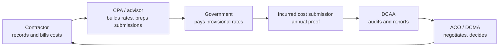

# GovCon Compliance: Learning Map

2026-09-20 · @Someone

## The big picture

The whole industry is one loop: the contractor records costs, bills the government for them, and later proves the bills were allowable, while the auditor tests that proof and the CPA sits in between helping the contractor avoid failing. To understand the problem deeply, you need to know each party's incentives, vocabulary, deadlines and data, not just the rules.

Read it as a cycle: costs get billed at provisional rates during the year, the contractor submits an annual incurred cost proposal, DCAA audits it (often years later), and the contracting officer settles final rates and disallows costs that failed. Your product sits before the annual proof, catching what would otherwise surface at audit.

| Party | What they want | What they fear | What they hold |
| --- | --- | --- | --- |
| Contractor (CFO/Controller) | Get paid fast, win the next contract, no surprises | Questioned costs, an inadequate accounting system finding, False Claims Act exposure | Timekeeping, payroll, GL, HRIS, contracts |
| Auditor (DCAA) | Protect the government from unallowable or mischarged costs, meet audit workload | Missing real problems, unsupported conclusions in their reports | Audit programs, sampling authority, the right to access records |
| CPA / advisor | Keep clients audit-ready and billable hours efficient | A client failing an audit on their watch, doing repetitive manual testing | Rate models, policies, past audit history, the client relationship |

By the end you should be able to trace one labor hour from an employee's timesheet, through payroll and the GL, into an indirect rate and a billing voucher, and then explain how DCAA would test each hop and where a CPA would have already looked.

## Foundation: the rule stack

Everything reduces to one test: is a cost allowable, allocable and reasonable under the contract, FAR Part 31 and the Cost Accounting Standards? Learn the rules in this order, because each layer only makes sense once you have the one before it.

| Layer | What to learn | Why it matters for labor |
| --- | --- | --- |
| Contract types (FAR Part 16) | Firm-fixed-price vs. time-and-materials vs. cost-plus (CPFF, CPAF). Who bears cost risk in each. | Audit exposure is concentrated in cost-type and T&M contracts, where the government reimburses actual cost or hours. FFP mostly escapes cost audit. |
| Cost principles (FAR Part 31, esp. 31.201-2 to 31.205) | Allowability, allocability, reasonableness; the specific cost items (compensation 31.205-6, unallowables like entertainment, alcohol, lobbying, fines). | Defines what a legitimate labor cost is, including compensation limits and uncompensated overtime. |
| Cost Accounting Standards (48 CFR 9904) | CAS 401 (consistency), 402 (consistent direct vs. indirect), 405 (unallowable costs), 406 (cost accounting period), 418 (indirect allocation), 420 (IR&D/B&P). Coverage thresholds and modified vs. full coverage. | CAS 402 is the direct/indirect classification consistency check in your list. Most mid-market firms have modified coverage or are exempt, so learn who is actually covered. |
| Payment and audit clauses | FAR 52.216-7 (Allowable Cost and Payment), 52.216-7(d) incurred cost submission within six months of fiscal year end, 52.215-2 (Audit and Records), 52.232-7 (T&M payments). | These clauses give DCAA the right to audit and set the ICS deadline and billing mechanics. |
| Accounting system adequacy | FAR 52.216-7(a), DFARS business system rules (252.242-7006), SF 1408 pre-award survey criteria. | The 18 adequacy criteria are effectively the checklist an auditor uses on your data flows. |
| Enforcement backdrop | False Claims Act, mandatory disclosure (FAR 52.203-13), record retention (FAR 4.703, typically three years after final payment). | Explains why customers care about mischarging: it converts from an accounting error into fraud exposure if it is knowing. |

For each layer, do one thing: read the clause itself, then find one plain-language explainer from a GovCon CPA or law firm. The clause tells you what the test is, and the explainer tells you how practitioners actually apply it. Expect to reread FAR 31.201 and 52.216-7 several times.

## The contractor's world

A contractor's compliance burden is one cost structure applied through several systems, so learn the structure first and the systems second.

**The cost structure.** Every dollar is either direct (charged to a specific contract, like a developer's hours on Contract A) or indirect (shared, then allocated). Indirect costs collect in pools, usually fringe, overhead and G&A, and each pool is allocated over a base such as direct labor dollars or total cost input. The result is a set of indirect rates. A typical services contractor builds a price as: direct labor, plus fringe, plus overhead, plus G&A, plus fee. You should be able to build this by hand in a spreadsheet, including how an unallowable cost is removed from the pool before rates are computed.

**Rates over time.** The contractor bills at provisional billing rates during the year, then computes actual rates after year end and reconciles in the incurred cost submission (ICS). The gap between provisional and actual is your rate drift check. Learn what triggers a rate revision mid-year and how underbilling or overbilling gets trued up.

**The labor lifecycle.** This is your domain. Follow one hour: an employee is hired in HRIS with a job title and pay rate, assigned to contracts, records time daily against a charge code, a supervisor approves, payroll pays them, the GL records the labor cost, and billing invoices the hours at the contract's labor category rate. Every arrow is a place where two systems can disagree.

**Contract mechanics.** Understand the contract's labor categories with minimum qualifications, ceiling rates, key personnel clauses, period of performance, funding limits (incremental funding, limitation of cost) and CLIN structure. Contracts are mostly PDFs, which is the unstructured-data problem you identified.

**The billing loop.** Learn vouchers (SF 1034 style cost vouchers, or invoices through WAWF/iRAPT), how T&M invoices differ from cost-reimbursable ones, and what a withhold looks like.

**Systems and their data.** Get hands on with what the exports really look like.

| System type | Common products | What to learn |
| --- | --- | --- |
| GovCon ERP / accounting | Deltek Costpoint, Unanet, JAMIS, PROCAS, QuickBooks with add-ons | Chart of accounts, project cost structure, labor cost posting, indirect rate setup |
| Timekeeping | Deltek Time & Expense, Unanet timesheets, ADP, spreadsheets | Daily entry rules, approval workflow, audit trail and edit history, what metadata is exportable |
| Payroll / HRIS | ADP, Paycom, Paylocity, BambooHR | Pay period vs. work period, job titles, salary vs. hourly, exempt status |
| Contracts | PDFs, sometimes a contract management tool | Labor category tables, rates, ceilings, period of performance |

A practical way to learn this: ask friendly contractors or CPAs for a sample anonymized export from each system, or use vendor demo environments, and try to reconcile them yourself.

## The auditor's world

DCAA is an audit and advisory agency, not a decision-maker: it reports findings to the contracting officer, who decides what to do. That distinction shapes everything, because a DCAA finding is a recommendation to disallow, and the ACO or DCMA negotiates the outcome. Learn the audit types, the method and the vocabulary.

| Audit type | When it happens | What the auditor tests |
| --- | --- | --- |
| Accounting system / pre-award survey (SF 1408) | Before a first cost-type award, or on a triggering event | Whether the system can segregate direct and indirect, accumulate costs by contract, and support timekeeping and billing |
| Incurred cost audit | After each annual ICS, often years later | Allowability, allocability and reasonableness of every claimed cost, and the indirect rate calculation |
| Floor checks (labor) | Unannounced, during the year | Whether the employee actually knows how they charge time, and whether timekeeping controls operate as described |
| Labor / MAAR reviews | Part of business system and incurred cost work | Timekeeping, labor distribution and payroll-to-GL agreement |
| Billing system review | Periodic | Whether vouchers agree with the books and contract terms |
| Forward pricing / proposal audits | Before award or modification | Whether proposed rates and labor mixes are supportable |

**How an audit runs.** Learn the sequence: entrance conference, risk assessment and audit program selection, data requests, sampling and testing (often judgmental and risk-based), preliminary findings, exit conference, draft report, contractor response, final report to the ACO. Auditors want traceable support for each sampled transaction, so "can you show me the timesheet, the approval, the payroll record and the GL entry" is the core motion your product automates.

**The vocabulary.** Questioned cost means the auditor believes it is unallowable or unsupported, and unsupported cost means the contractor did not provide adequate documentation. Also learn: qualified opinion vs. adverse opinion vs. disclaimer, significant deficiency, material weakness, inadequate vs. adequate system, disallowance, and withhold. The terms carry precise consequences.

**Primary sources.** The DCAA Contract Audit Manual (DCAA-M 7640.1) is public and is the single best window into how auditors think, because it contains the audit programs and the criteria. The DCAA pamphlet Information for Contractors (DCAA-P 7641.90) is the contractor-facing companion, and it explains what DCAA expects for timekeeping and accounting systems.

**Structural realities to understand.** DCAA has a large incurred cost backlog and prioritizes by risk, so many small contractors go years without an audit, and the government uses a risk-based approach and sometimes accepts submissions without full audit. That changes how urgent customers feel, so confirm the current state with practitioners rather than assuming.

## The CPA's world

GovCon CPA and advisory firms are the translators between the contractor's books and the auditor's expectations, and they are also your most likely channel. Learn what they sell, how they work, and where their time goes, because that is where your product either saves hours or doesn't.

| Service | What it involves | Where the manual pain is |
| --- | --- | --- |
| Incurred cost submission prep | Building the ICS schedules (labor, indirect rates, contract-level costs) from the GL each year | Pulling and tying out data across systems, removing unallowables, rebuilding schedules by hand |
| Indirect rate development and monitoring | Setting provisional billing rates, monitoring actual vs. provisional, revising mid-year | Monthly spreadsheet rate models that drift from the GL |
| Accounting system readiness / SF 1408 prep | Gap assessments against the adequacy criteria, policy and procedure writing | Interviews and manual walkthroughs instead of data testing |
| Mock audits and floor check prep | Simulating what DCAA will test, training employees on timekeeping | Sampling by hand from exports |
| Outsourced accounting for GovCon | Bookkeeping and controller work inside Costpoint, Unanet or QuickBooks | Reconciling timekeeping to payroll to GL each period |
| DCAA audit support | Responding to data requests, negotiating findings, supporting the contractor through the exit conference | Assembling evidence trails under time pressure |

**How they are paid.** Most bill hourly or on monthly retainers, so anything that reduces hours is a direct revenue tradeoff unless the firm can repackage the saved time as a higher-value or fixed-fee service. This is the central commercial question for your channel thesis, so test it directly in interviews.

**The CPA's real constraints.** Learn the difference between attest services (audit, review, examination, which require independence and licensure) and advisory or compilation work, because independence rules can restrict what an attesting firm may do for the same client. Also learn professional standards that shape their caution: AICPA standards, and Government Auditing Standards (the Yellow Book) for audits of government awards. This is why your positioning constraint, no attestation or audit-opinion claims, matters.

**How they think about risk.** A CPA's reputation depends on their clients passing audits, so they are conservative about tools whose outputs they cannot explain. Deterministic, lineage-tagged findings fit that, and black-box AI scoring does not.

## Labor deep dive

Labor is where the three worlds collide, so learn the specific rules and the specific ways they fail. The point is to know which of your planned checks map to a real audit criterion and which are your own inventions.

| Rule or expectation | Source | Failure pattern in the data |
| --- | --- | --- |
| Time recorded contemporaneously, daily, by the employee, including for indirect and uncompensated time | DCAA accounting system criteria, DCAA-P 7641.90 | Entries made days later, bulk entry at period end, timestamps clustered late Friday, supervisor entering time for others |
| Changes to submitted timesheets are documented, approved and explained | Timekeeping control expectations | Untracked edits, edits after approval, edits clustered near billing close, no reason codes |
| Labor charged to the right contract and category | Contract terms, CAS 402 | Employee charged to a contract they are not assigned to, charges after period of performance ends, charges over the funded amount |
| Labor category matches the employee's qualifications | Contract labor category definitions, T&M clauses | HRIS title or education below the category's minimum, billing a senior category for a junior person (a common source of false claims cases) |
| Hours and dollars agree across systems | Accounting system adequacy | Timekeeping hours differ from payroll hours, payroll differs from GL labor, GL differs from billed amounts |
| Direct and indirect treatment is consistent | CAS 402, FAR 31.202 and 31.203 | Same person or activity charged direct one month and indirect the next |
| Uncompensated overtime handled consistently | FAR 31.205-6, DCAA guidance | Exempt employees' total hours not recorded, or salary spread inconsistently across contracts |
| Billing rates match approved rates | Contract, provisional billing rate agreements | Invoices at stale rates, indirect rate drift beyond a tolerance |

Two lessons to take from this list. First, several of your checks are corroborated by published audit criteria, which you can cite in findings. Second, a few, like Friday-afternoon clustering, are analytic signals rather than rule violations, so frame them as risk indicators that need a reviewer's judgment, not as findings of noncompliance. Confirm with practitioners which patterns actually trigger auditor attention.

## Learning plan

Six weeks of part-time study gets you fluent enough to run credible discovery calls, and each week ends with something you can build or explain, not just read. Alternate reading with talking to people, since practitioners will correct what the documents leave out.

| Week | Focus | Read | Produce |
| --- | --- | --- | --- |
| 1 | Contract types and cost principles | FAR Part 16 overview, FAR 31.201 through 31.205-6, a practitioner explainer on allowable cost | A one-page explanation of allowable, allocable, reasonable with three labor examples |
| 2 | Indirect rates and CAS | CAS 401, 402, 418; a rate development primer; FAR 52.216-7 | A spreadsheet computing fringe, overhead and G&A rates for a fictional $40M contractor, with provisional vs. actual drift |
| 3 | The labor lifecycle and systems | Vendor documentation and demos for Costpoint, Unanet and timekeeping modules | A data-flow diagram of hire to timesheet to payroll to GL to invoice, marking every reconciliation point |
| 4 | The auditor | DCAA Contract Audit Manual chapters on labor and accounting systems; DCAA-P 7641.90; SF 1408 checklist | A table mapping each of your planned checks to the specific audit criterion it supports |
| 5 | The CPA and the audit lifecycle | ICS requirements and schedules, GovCon CPA firm blog posts and webinars, a sample audit report if available | A timeline of one contract year through ICS, audit and settlement, with who does what |
| 6 | Enforcement and edge cases | Published False Claims Act settlements involving labor mischarging, DCAA floor check writeups | A list of real-world failure patterns ranked by how detectable they are from exports |

**Free primary sources to start with:** the eCFR for FAR and CAS text, acquisition.gov for current FAR, the DCAA website's contractor guidance and manuals, and Defense Acquisition University's free courses. Add trade groups and communities where practitioners talk shop, such as NCMA and GovCon-focused CPA firm webinars.

**Fastest accelerator:** shadow the work. One hour with a controller walking through how they close a period and prep an ICS teaches more than a week of reading. Ask a contractor or CPA to screen-share a real timesheet-to-invoice trace with client details removed.

## Interview questions and things to verify

Discovery is the other half of learning: the documents give you the rules, and these questions give you the practice. Ask about the last time something went wrong, not what people think in general.

| Who | Questions worth asking |
| --- | --- |
| Controller / CFO | Walk me through your last period close for labor. Where do timekeeping, payroll and the GL disagree, and who finds out? What did your last DCAA interaction cost you in hours and dollars? What do you check today before you submit an ICS? |
| Outsourced bookkeeper | How many hours a month go to reconciling timesheets to payroll to GL? Which exports do you pull, and what do you do by hand in Excel? What do you wish you could check but can't? |
| GovCon CPA | Which findings do you see most often for labor? What do you do in a mock audit that is repetitive? How would a tool that saves you hours change how you bill? Would you resell or recommend it, and what would make you refuse? |
| Former DCAA auditor or DCAA consultant | What actually triggers a deeper look? Which timekeeping patterns do auditors care about in practice vs. in the manual? What evidence makes a finding go away? |

**Things to verify as current before relying on them.** Your project notes cite the CMMC Phase 2 suspension and the October 2026 CAS threshold change, and I have not confirmed either, so check them against primary sources. Also confirm: whether the FAR overhaul under way has renumbered or reworded Part 31 and the clauses cited above, the current DCAA incurred cost backlog and how the agency now prioritizes audits, and the current ICS submission and audit-waiver practices. Regulation text moves, so treat clause numbers here as starting points and check the live eCFR and acquisition.gov versions.

**How you know you are ready.** You can explain, without notes, why a mismatched labor category is both a compliance issue and a billing issue, how DCAA would find it, what a CPA would have done to prevent it, and what evidence the contractor would need to defend it.
